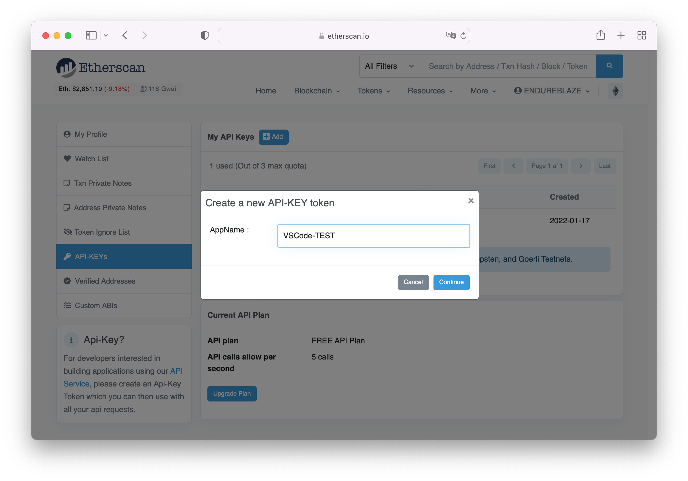
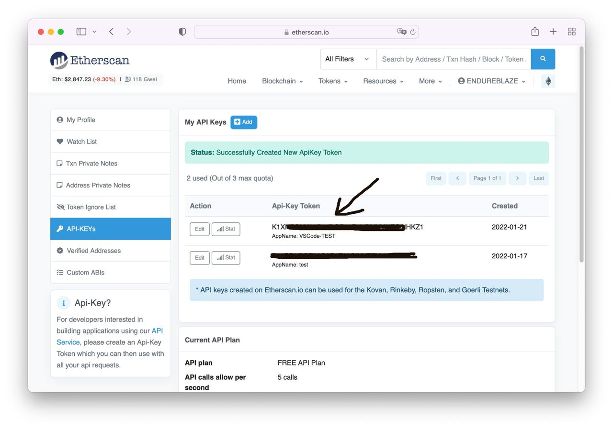

# Contract Viewer

[English](docs/README-EN.md) | [中文](README.md)

**Contract Viewer** 是一个 VS Code 扩展，他可以帮你从区块链浏览器下载合约代码，只需要一个合约地址即可下载。

> 目前仅支持以太坊使用 `Solidity` 的智能合约，后续会支持更多类型。

## 快速开始

1. 配置一个 API
    1. 在 [Erherscan](https://etherscan.io/login) 注册一个用户。
    2. 登陆之后找到 `API-KEYs` 选项新建一个 API，然后复制 Token 内容。

    

    
    3. 在 `VS Code 的命令面板` 中输入 `Config API` 找到 `Contract Viewer: Config API` 选项，然后在新打开的页面中粘贴你的的 Token 内容。

    
    4. 完成！现在可以关闭这个页面了。

2. 下载一个合约
    1. 在 `VS Code 的命令面板` 中输入 `getContract` 找到 `Contract Viewer: Get contract code` 选项。
    2. 选择要下载的合约类型。
    3. 输入合约地址。
    4. 等待解析完成。
    5. 选择一个**空目录**保存合约。
    6. 合约代码写入文件。
    
    7. 完成！现在可以查看刚次下载的合约了。

## 命令

在 `VS Code 的命令面板` 中输入 `Contract Viewer` 可以检索到 `Contract Viewer` 的所有命令。

1. ***`Contract Viewer: Config API`***

    > 快速打开配置 API 的页面。

2. ***`Contract Viewer: Get contract code`***

    > 下载合约。

## VS Code 配置项

您可以在 `VS Code 用户设置`中找到以下 `Contract Viewer` 配置项。

1. ***`contract-viewer.setting.api.eth`***
    以太坊 API 配置，如果没有配置 API 将无法下载合约。
