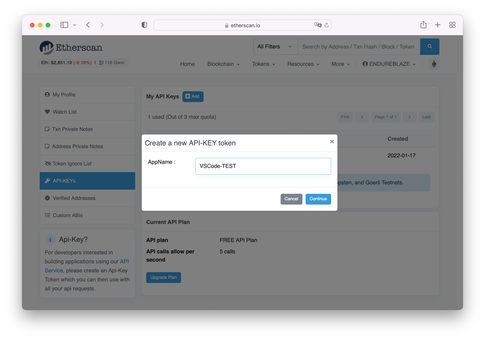
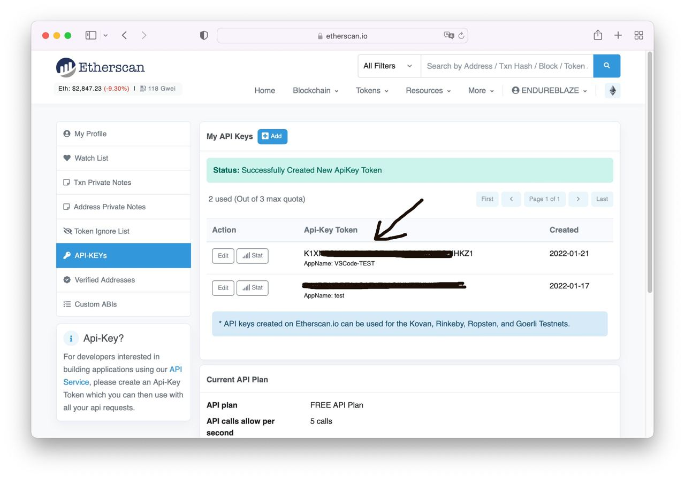
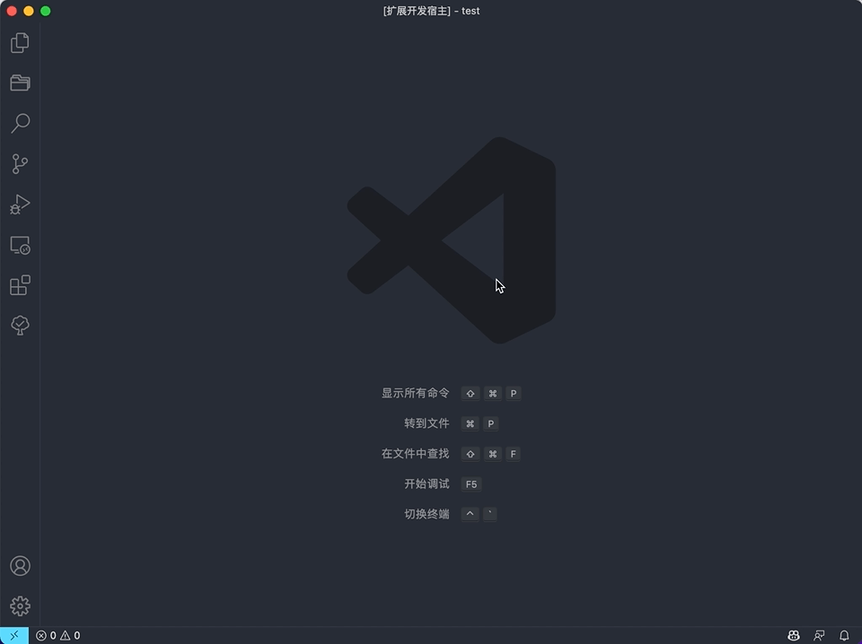

# Contract Viewer

[English](README-EN.md) | [Chinese](../README.md)

**Contract Viewer** is a VS Code extension that helps you download contract code from the blockchain viewer, just need a contract address to download, click [here](#SupportList) to see supported contracts.

> The example uses `Ethiopia Contracts`, which operates much the same way as other contract types.

## Quick start

1. Configure an API
    1. Register a user at [Erherscan](https://etherscan.io/login).
    2. After logging in, find the `API-KEYs` option to create a new API, and copy the Token content.

    

    
    3. Type `Config API` in the `VS Code command panel` and find the `Contract Viewer: Config API` option, then paste your Token content in the newly opened page.

    
    4. Done! Now you can close this page.

2. Download a contract
    1. Type `getContract` in `VS Code's command panel` and find the `Contract Viewer: Get contract code` option.
    2. Select the type of contract you want to download.
    3. Enter the contract address.
    4. Wait for the parsing to complete.
    5. Select an **empty directory** to save the contract.
    6. Write the contract code to the file.
    
    7. Done! Now you can view the contract you just downloaded.

## Commands

Type `Contract Viewer` in `VS Code's command panel` to retrieve all commands of `Contract Viewer`.

1. ***`Contract Viewer: Config API`***

    > Quickly open the Config API page.

2. ***`Contract Viewer: Get contract code`*** > Download contract.

    > Download the contract.

## VS Code configuration items

You can find the following `Contract Viewer` configuration items in the `VS Code User Settings`.

1. ***`contract-viewer.setting.api.eth`***
    Ethernet API configuration, if you don't configure the API, you will not be able to download contracts.

## Change Log

See Change Log [here](../CHANGELOG.md).

## SupportList

Ethereum contracts: <https://etherscan.io/>  
Binance Smart Contracts: <https://bscscan.com/>
